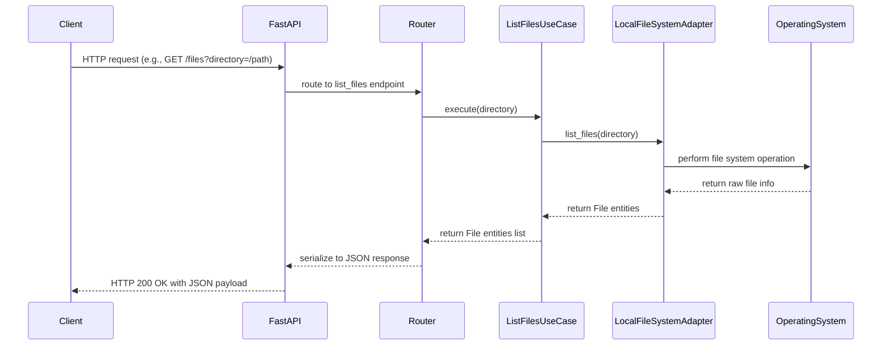

# API Architecture Integration

## 1. Module Organization

- **src/api/routers.py**
  Define FastAPI APIRouter instances and bind endpoints to use cases.

- **src/api/schemas.py**
  Declare Pydantic models for request bodies and response payloads.

- **src/api/dependencies.py**
  Provide FastAPI dependency functions that retrieve use case instances from the container.

- **src/main.py**
  Instantiate `FastAPI()` application, include routers, and mount middleware.

## 2. File Layout

```text
src/
  api/
    routers.py         # Endpoint definitions grouped by resource
    schemas.py         # Request/response models (Pydantic)
    dependencies.py    # FastAPI dependency injection functions
  main.py              # Bootstraps FastAPI app
container.py           # DependencyContainer remains source of truth
```

## 3. Mapping Use Cases to Routers

In [`src/api/routers.py`](src/api/routers.py):

```python
from fastapi import APIRouter, Depends, HTTPException
from api.schemas import (
    FileListRequest, FileInfo, FileListResponse,
    FileSearchRequest, GenerateTextRequest, GenerateTextResponse,
    ErrorResponse
)
from api.dependencies import (
    get_list_files_uc, get_search_files_uc, get_generate_text_uc
)

router = APIRouter()

# List files
@router.get("/files", response_model=FileListResponse, responses={400: {"model": ErrorResponse}})
def list_files(params: FileListRequest = Depends()):
    try:
        files = get_list_files_uc().execute(params.directory)
        return FileListResponse(files=[FileInfo.from_entity(f) for f in files])
    except Exception as e:
        raise HTTPException(status_code=400, detail=str(e))

# Search files
@router.get("/files/search", response_model=FileListResponse, responses={400: {"model": ErrorResponse}})
def search_files(params: FileSearchRequest = Depends()):
    try:
        files = get_search_files_uc().execute(params.directory, params.pattern)
        return FileListResponse(files=[FileInfo.from_entity(f) for f in files])
    except Exception as e:
        raise HTTPException(status_code=400, detail=str(e))

# Generate text
@router.post("/generate-text", response_model=GenerateTextResponse, responses={400: {"model": ErrorResponse}})
def generate_text(body: GenerateTextRequest):
    try:
        text = get_generate_text_uc().execute(
            prompt=body.prompt,
            system_message=body.system_message,
            temperature=body.temperature,
            max_tokens=body.max_tokens
        )
        return GenerateTextResponse(text=text)
    except Exception as e:
        raise HTTPException(status_code=500, detail=str(e))
```

## 4. Dependency Injection via FastAPI

In [`src/api/dependencies.py`](src/api/dependencies.py):

```python
from fastapi import Depends
from container import container

def get_list_files_uc():
    return container.get_list_files_use_case()

def get_search_files_uc():
    return container.get_search_files_use_case()

def get_generate_text_uc():
    return container.get_generate_text_use_case()
```

In [`src/main.py`](src/main.py), modify to:

```python
from fastapi import FastAPI
from api.routers import router as api_router

app = FastAPI(title="Clean Architecture API")
app.include_router(api_router)
```

## 5. Sequence Diagram



## 6. OpenAPI-like Specification

```yaml
openapi: 3.0.0
info:
  title: Clean Architecture API
  version: 1.0.0
paths:
  /files:
    get:
      summary: List files in directory
      parameters:
        - name: directory
          in: query
          required: true
          schema:
            type: string
      responses:
        "200":
          description: List of files
          content:
            application/json:
              schema:
                $ref: "#/components/schemas/FileListResponse"
        "400":
          description: Bad request
          content:
            application/json:
              schema:
                $ref: "#/components/schemas/ErrorResponse"
        "404":
          description: Not found
          content:
            application/json:
              schema:
                $ref: "#/components/schemas/ErrorResponse"
        "500":
          description: Internal server error
          content:
            application/json:
              schema:
                $ref: "#/components/schemas/ErrorResponse"
  /files/search:
    get:
      summary: Search files by pattern
      parameters:
        - name: directory
          in: query
          required: true
          schema:
            type: string
        - name: pattern
          in: query
          required: true
          schema:
            type: string
        - name: recursive
          in: query
          required: false
          schema:
            type: boolean
            default: false
      responses:
        "200":
          description: Matching files list
          content:
            application/json:
              schema:
                $ref: "#/components/schemas/FileListResponse"
        "400":
          description: Bad request
          content:
            application/json:
              schema:
                $ref: "#/components/schemas/ErrorResponse"
        "404":
          description: Not found
          content:
            application/json:
              schema:
                $ref: "#/components/schemas/ErrorResponse"
        "500":
          description: Internal server error
          content:
            application/json:
              schema:
                $ref: "#/components/schemas/ErrorResponse"
  /generate-text:
    post:
      summary: Generate text via LLM
      requestBody:
        required: true
        content:
          application/json:
            schema:
              $ref: "#/components/schemas/GenerateTextRequest"
      responses:
        "200":
          description: Generated text response
          content:
            application/json:
              schema:
                $ref: "#/components/schemas/GenerateTextResponse"
        "400":
          description: Invalid input
          content:
            application/json:
              schema:
                $ref: "#/components/schemas/ErrorResponse"
        "500":
          description: LLM error
          content:
            application/json:
              schema:
                $ref: "#/components/schemas/ErrorResponse"
components:
  schemas:
    FileInfo:
      type: object
      properties:
        name:
          type: string
        path:
          type: string
        size_mb:
          type: number
        type:
          type: string
    FileListResponse:
      type: object
      properties:
        files:
          type: array
          items:
            $ref: "#/components/schemas/FileInfo"
    ErrorResponse:
      type: object
      properties:
        error:
          type: string
        message:
          type: string
    GenerateTextRequest:
      type: object
      required:
        - prompt
      properties:
        prompt:
          type: string
        system_message:
          type: string
        temperature:
          type: number
        max_tokens:
          type: integer
    GenerateTextResponse:
      type: object
      properties:
        text:
          type: string
        model:
          type: string
        provider:
          type: string
```
