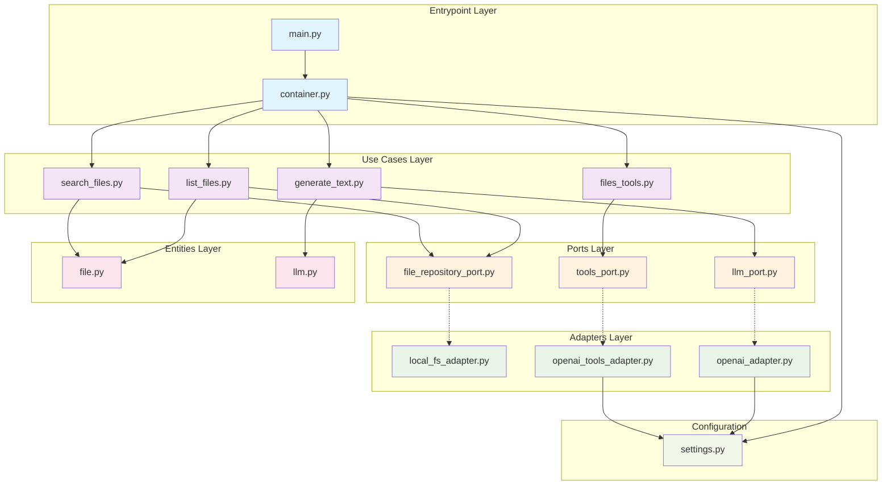

# Architecture Documentation

## Overview

This Python project follows Clean Architecture principles, organizing code into distinct layers with clear separation of concerns and dependency inversion via ports and adapters pattern. The architecture promotes maintainability, testability, and flexibility by ensuring that business logic remains independent of external concerns.

## Architecture Layers

The project is structured into the following layers, each with specific responsibilities:

### 1. Entities

**Location**: [`src/entities/`](../src/entities/)

Core business objects that encapsulate the most general and high-level rules:

- [`file.py`](../src/entities/file.py) - File entity representing file system objects
- [`llm.py`](../src/entities/llm.py) - LLM entity for language model interactions

### 2. Ports (Interfaces)

**Location**: [`src/ports/`](../src/ports/)

Abstract interfaces that define contracts for external dependencies:

#### File Operations

- [`file_repository_port.py`](../src/ports/files/file_repository_port.py) - Interface for file system operations

#### LLM Operations

- [`llm_port.py`](../src/ports/llm/llm_port.py) - Interface for language model interactions
- [`tools_port.py`](../src/ports/llm/tools_port.py) - Interface for LLM tool capabilities

### 3. Adapters (Implementations)

**Location**: [`src/adapters/`](../src/adapters/)

Concrete implementations of the ports, handling external system integration:

#### File System Adapters

- [`local_fs_adapter.py`](../src/adapters/files/local_fs_adapter.py) - Local file system implementation

#### LLM Adapters

- [`openai_adapter.py`](../src/adapters/llm/openai_adapter.py) - OpenAI API integration
- [`openai_tools_adapter.py`](../src/adapters/llm/openai_tools_adapter.py) - OpenAI tools functionality

### 4. Use Cases (Business Logic)

**Location**: [`src/use_cases/`](../src/use_cases/)

Application-specific business rules and orchestration logic:

#### File Operations

- [`list_files.py`](../src/use_cases/files/list_files.py) - File listing functionality
- [`search_files.py`](../src/use_cases/files/search_files.py) - File search capabilities

#### LLM Operations

- [`generate_text.py`](../src/use_cases/llm/generate_text.py) - Text generation workflows

#### Tool Integration

- [`files_tools.py`](../src/use_cases/tools/files_tools.py) - File-related tool implementations

### 5. Configuration

**Location**: [`src/config/`](../src/config/)

- [`settings.py`](../src/config/settings.py) - Application configuration and environment settings

### 6. Entrypoint / CLI

**Location**: [`src/`](../src/)

- [`main.py`](../src/main.py) - Application entry point and CLI interface
- [`container.py`](../src/container.py) - Dependency injection container
- [`exceptions.py`](../src/exceptions.py) - Custom exception definitions

## Architecture Diagram

## Key Architectural Principles

### Dependency Inversion

- High-level modules (use cases) do not depend on low-level modules (adapters)
- Both depend on abstractions (ports/interfaces)
- Abstractions do not depend on details; details depend on abstractions

### Separation of Concerns

- Each layer has a single, well-defined responsibility
- Business logic is isolated from external dependencies
- Infrastructure concerns are separated from domain logic

### Testability

- Ports enable easy mocking and testing of business logic
- Each layer can be tested independently
- Clear boundaries facilitate unit and integration testing

## Project Structure Benefits

- **Maintainability**: Clear separation makes code easier to understand and modify
- **Flexibility**: Easy to swap implementations (e.g., different LLM providers)
- **Testability**: Dependency injection enables comprehensive testing
- **Scalability**: New features can be added without affecting existing code
- **Independence**: Business logic remains independent of frameworks and external services

## Testing Strategy

The project includes comprehensive tests organized to mirror the source structure:

- **Unit Tests**: Test individual components in isolation
- **Integration Tests**: Test interactions between layers
- **Test Configuration**: [`pytest.ini`](../pytest.ini) and [`conftest.py`](../tests/conftest.py) provide test setup

## Dependencies and Configuration

- **Package Management**: [`pyproject.toml`](../pyproject.toml) defines project dependencies and metadata
- **Environment Configuration**: [`.env.example`](../.env.example) shows required environment variables
- **Python Version**: [`.python-version`](../.python-version) specifies the Python version requirement
- **Lock File**: [`uv.lock`](../uv.lock) ensures reproducible dependency resolution
